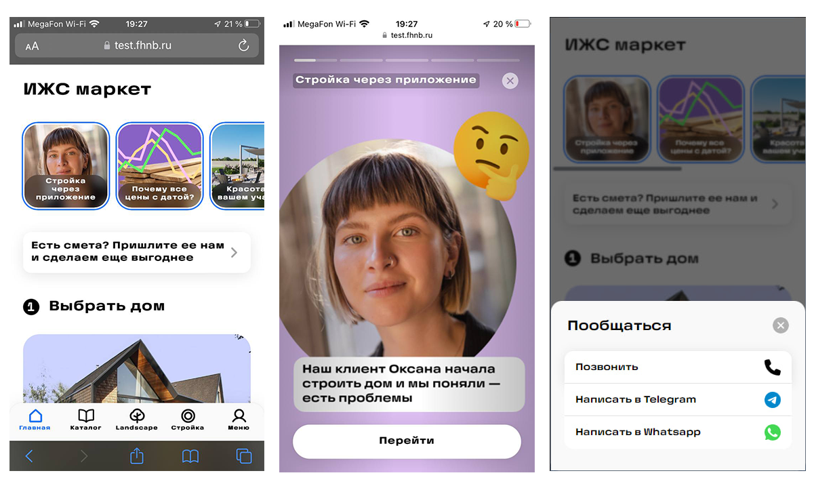

# Market-Vue

[](https://vuejs.org/guide/)
[](https://cli.vuejs.org/)
[](https://v4.vuex.vuejs.org/)
[](https://github.com/riderx/vue-timer-hook)

## ИЖС Маркет, верстка + vue

> [Test website with latest build](https://test.fhnb.ru/market/)

| Image | Video |
|---|---|
|  | <video src="https://user-images.githubusercontent.com/1816594/227786048-25ead16b-3bc6-4a64-a146-7cc1ec0fa041.mp4"></video> |


[Figma with design](https://www.figma.com/file/ce7zEQ3laKltkxKZRC1ist/%D0%98%D0%96%D0%A1-%7C-App?node-id=9302%3A4846&t=edX0o7lOmBQKzUHq-1)

---
### 1. Preparing

  1. Install Git and node.js enviroment.
  2. Clone repository to folder or download and unpack zip.
  3. Open terminal, go to repository folder (example: `cd Z:\\Git\Market\market-test`).
  4. Install Vue Cli with command `npm install -g @vue/cli@5.0.8`.
  5. Install dependences with `npm install --legacy-peer-deps`.
  6. Type `npm run serve` to build and run local server, now you can visit website with url: `127.0.0.1:8080` or `localhost:8080`.
  7. You may also build project to distribute (upload to webserver) with command `npm run build`.

---
### 2. Features

  1. Fetch data from json url.
  2. View stories with navigation, viewed state and animated timer progressbar, autoplay, images and videos, covered full screen or center and contain image.
  3. Modal window with contacts (or another content)
  4. Separated to components
  5. Store data in Vuex
  6. Can be pinned on ios home screen (PWA)
  7. Stories can contain image or video
  8. Compact stories view on desktop/tablet
  9. Wow, ArtLebedev font))0

---
### 3. data.json structure
```
{
  "appTitle": "ИЖС маркет", // app title
  "stories": [ // array of objects
    {
      "iconPreviewImage": "", // story icon preview image
      "iconText": "Стройка через приложение", // text string on story icon
      "storyText": "Стройка через приложение", // text string on top of story
      "storyMedia": "", // video or image file url
      "storyBackground": "#dcbef0", // background color/gradient/image src('')
      "storyMediaPoster": "", url ti video poster image (shows before video loaded)
      "storyMediaType": "image", // video/image, image by default
      "storyMediaFit": "contain", // contain - fit all image/video in center, cover - zoom image/video in center to fill all display width/height
      "storyShowSeconds": 0, // how long story is shown, 0 or empty is 5 seconds
      "buttonText": "Перейти", // button text
      "buttonAction": "#",
      "storyViewed": false
    },
  ],
  "mainPageButton": {
    "buttonText": "Есть смета? Пришлите ее нам и сделаем еще выгоднее", // main page button text
    "buttonAction": "#"
  },
  "sections": [ // array of objects
    {
      "sectionImage": "", // section image
      "sectionText": "Выбрать дом", // section text
      "buttonText": "Выбрать дом", // section button text
      "buttonAction": "#"
    },
  ]
}
```
---

  [](https://fhnb.ru/)
